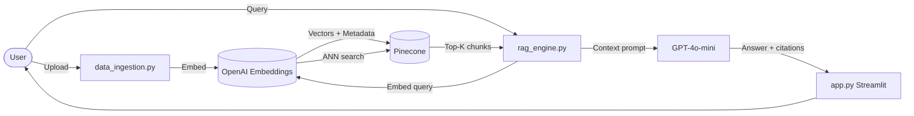

# 🔍 RAG Explorer

> Production-quality **Retrieval Augmented Generation (RAG)** system with metadata filtering. Powered by OpenAI Embeddings + GPT-4o-mini + Pinecone. Beautiful Streamlit UI.

[](https://share.streamlit.io)

---

## ✨ Features

| Feature | Details |
|---|---|
| **Document formats** | PDF, TXT, DOCX |
| **Metadata filtering** | Category, source, author, date range, tags |
| **LLM** | GPT-4o-mini with inline citations |
| **UI** | Dark glassmorphism Streamlit app |
| **Query history** | Sidebar with replay & export (JSON/CSV) |
| **Performance metrics** | Retrieval ms, generation ms, tokens used |
| **Deployment** | Docker · Streamlit Cloud · docker-compose |

---

## 🏗️ Architecture



---

## 📁 Project Structure

```
RAG/
├── app.py                # Streamlit UI  (Search / Upload / Manage tabs)
├── rag_engine.py         # Embed → retrieve → generate orchestration
├── data_ingestion.py     # File loading, text chunking, metadata extraction
├── models.py             # Pydantic v2 data models
├── config.py             # Settings — reads .env locally, st.secrets on Cloud
├── sample_data.py        # Populate Pinecone with 15 sample documents
├── requirements.txt
├── .env.example
├── .gitignore
├── Dockerfile
├── docker-compose.yml
└── tests/               # 40+ unit tests (all mocked, no API keys needed)
```

---

## 🚀 Local Development

### 1. Clone

```bash
git clone https://github.com/<your-username>/rag-explorer.git
cd rag-explorer
```

### 2. Install

```bash
python -m venv .venv
.venv\Scripts\activate        # Windows
pip install -r requirements.txt
```

### 3. Configure secrets

```bash
copy .env.example .env
```

Edit `.env` and fill in your keys:

```env
OPENAI_API_KEY=sk-...
PINECONE_API_KEY=pcsk_...
PINECONE_ENVIRONMENT=us-east-1
PINECONE_INDEX_NAME=rag-index
```

> **Pinecone index** is **created automatically** on first launch — no manual setup needed.

### 4. Load sample data (recommended)

```bash
python sample_data.py
```

Loads 15 documents (Technology · Science · History) so you can search immediately.

### 5. Run

```bash
streamlit run app.py
# → http://localhost:8501
```

---

## 📤 Publish to GitHub

Run these commands once from the project folder:

```bash
# 1. Initialise git (if not already)
git init
git add .
git commit -m "Initial commit: RAG Explorer"

# 2. Create a repo on GitHub (https://github.com/new), then:
git remote add origin https://github.com/<your-username>/rag-explorer.git
git branch -M main
git push -u origin main
```

> ⚠️ The `.gitignore` already protects `.env` and `.streamlit/secrets.toml` from being committed.

---

## ☁️ Deploy Live on Streamlit Community Cloud (Free)

This is the recommended way to share your app so others can use it in their browser.

### Step 1 — Push to GitHub
Complete the "Publish to GitHub" steps above first.

### Step 2 — Connect to Streamlit Cloud

1. Go to **[share.streamlit.io](https://share.streamlit.io)** and sign in with GitHub.
2. Click **"New app"**.
3. Select your repository (`rag-explorer`) and branch (`main`).
4. Set **Main file path** to `app.py`.
5. Click **"Advanced settings"** → **"Secrets"**.

### Step 3 — Add your secrets

Paste the following into the Secrets box (replace with your real keys):

```toml
OPENAI_API_KEY = "sk-..."
PINECONE_API_KEY = "pcsk_..."
PINECONE_ENVIRONMENT = "us-east-1"
PINECONE_CLOUD = "aws"
PINECONE_INDEX_NAME = "rag-index"
```

> This is equivalent to your `.env` file — Streamlit Cloud stores them securely and they are **never exposed in your code or repo**.

### Step 4 — Deploy

Click **"Deploy!"**. Streamlit Cloud will install requirements and launch your app. In ~2 minutes you'll get a public URL like:

```
https://<your-username>-rag-explorer-app-xxxx.streamlit.app
```

Share this URL with anyone — no installation required on their end.

---

## 🐳 Docker Deployment (Self-hosted)

```bash
# Copy and fill in your keys
copy .env.example .env

# Build and start (detached)
docker-compose up --build -d

# View logs
docker-compose logs -f

# Stop
docker-compose down
```

App runs at `http://localhost:8501`.

---

## 🧪 Tests

No API keys required — all external calls are mocked.

```bash
pytest tests/ -v
```

---

## ⚙️ Configuration Reference

All settings can be overridden in `.env` (local) or the Streamlit Secrets panel (cloud):

| Variable | Default | Description |
|---|---|---|
| `OPENAI_API_KEY` | — | **Required** |
| `PINECONE_API_KEY` | — | **Required** |
| `PINECONE_ENVIRONMENT` | `us-east-1` | Index cloud region |
| `PINECONE_INDEX_NAME` | `rag-index` | Auto-created if missing |
| `EMBEDDING_MODEL` | `text-embedding-3-small` | OpenAI embed model |
| `LLM_MODEL` | `gpt-4o-mini` | Chat model |
| `CHUNK_SIZE` | `1000` | Characters per chunk |
| `CHUNK_OVERLAP` | `200` | Overlap between chunks |
| `DEFAULT_TOP_K` | `5` | Results per query |

---

## 🔒 Security

- API keys are never hard-coded. They are loaded from `.env` locally and from Streamlit's encrypted secrets store in production.
- `.env` and `secrets.toml` are listed in `.gitignore`.
- Docker container runs as a non-root user.

---

## License

MIT
